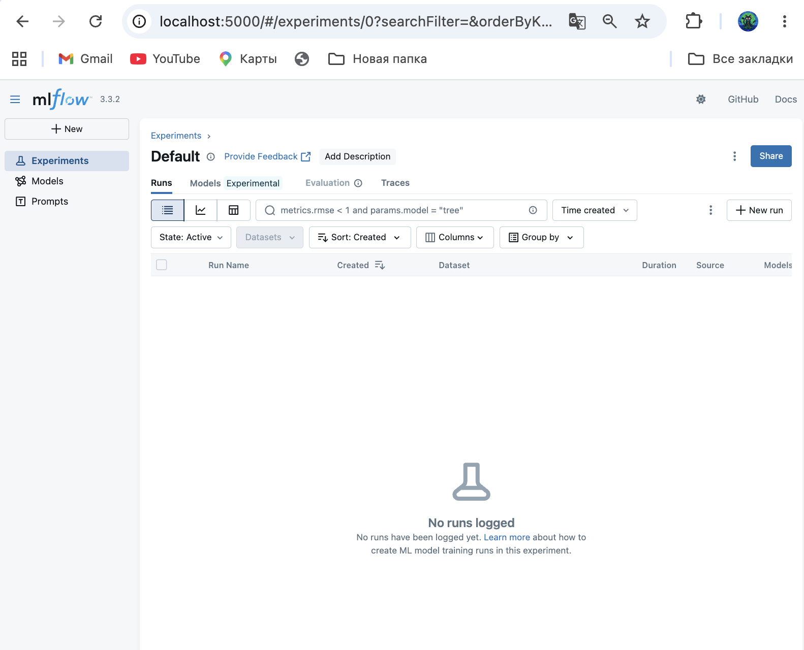
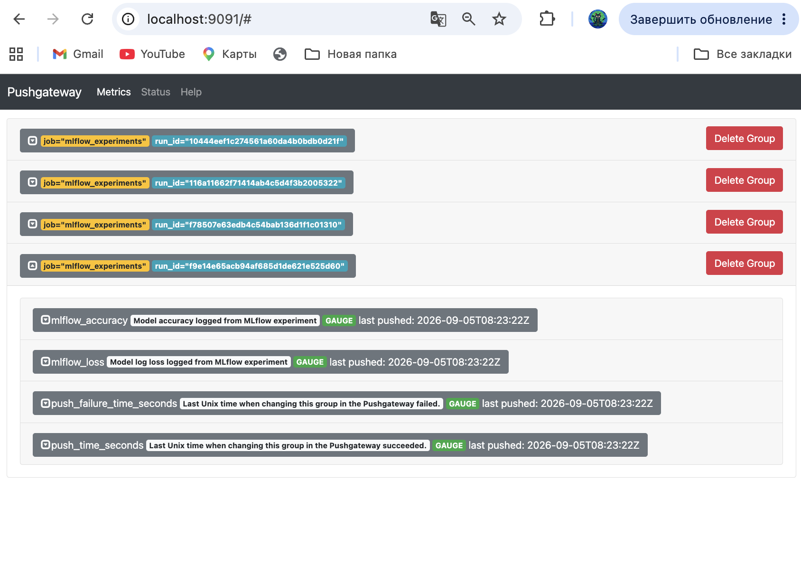
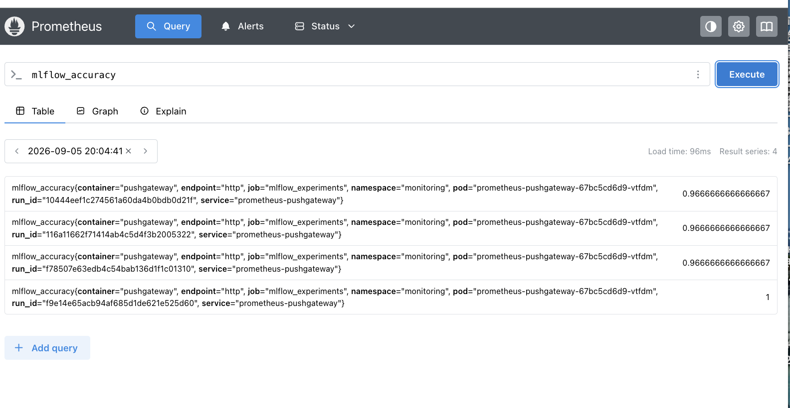
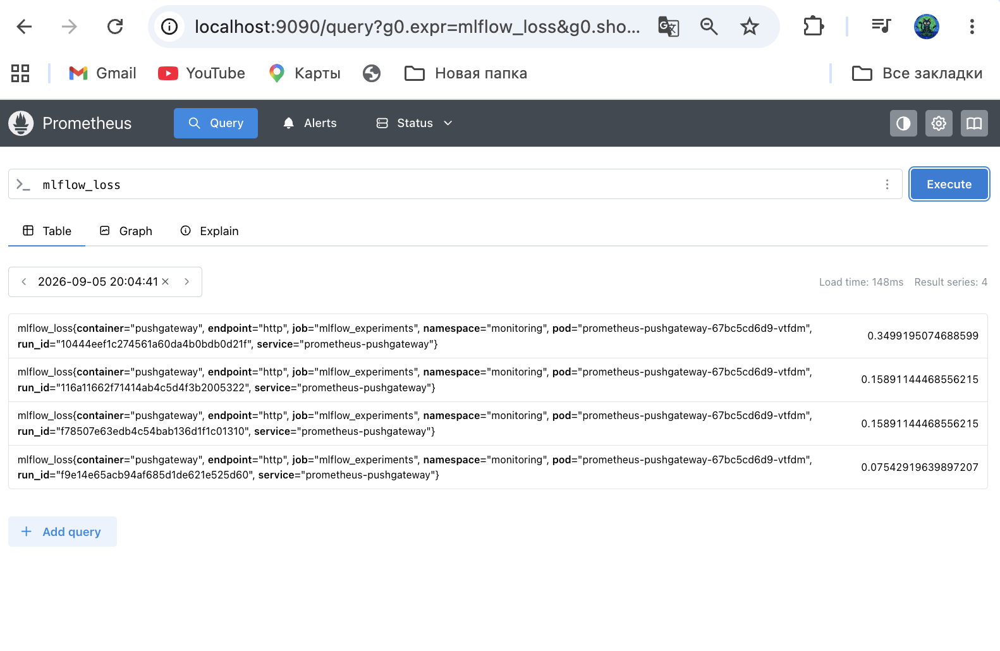
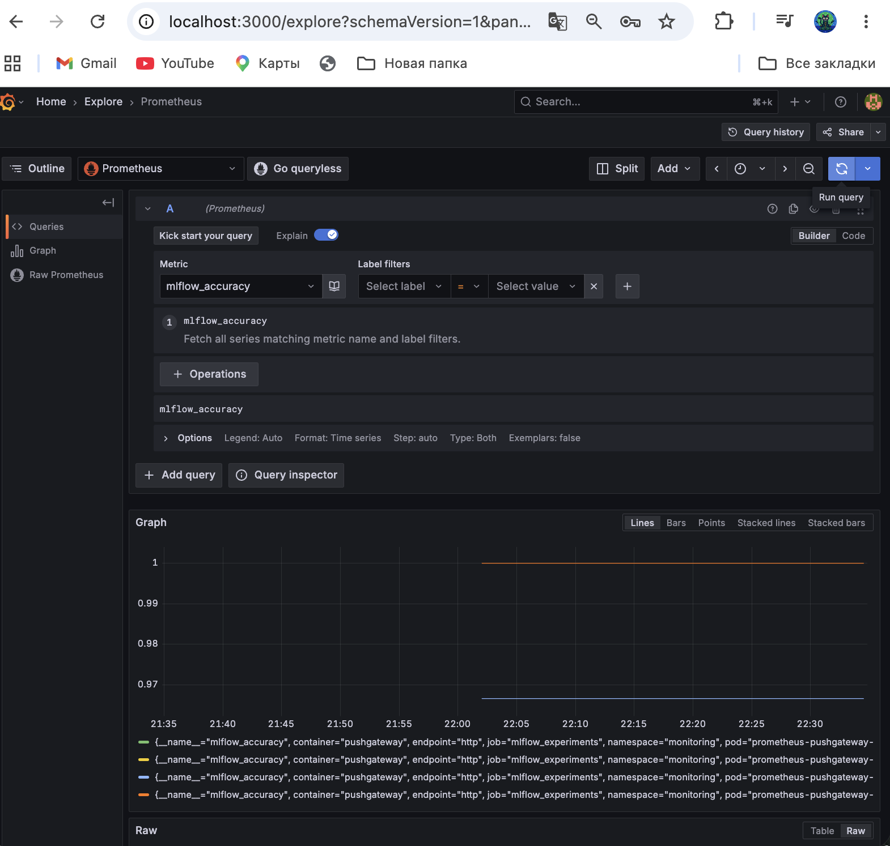
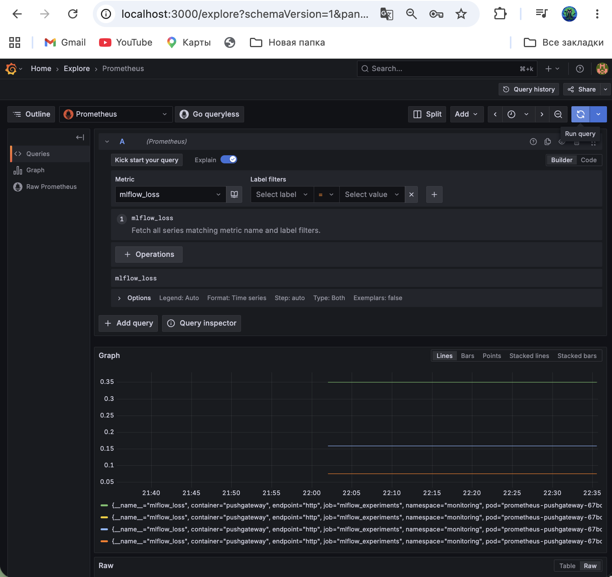

# MLOps Homework №4 — MLflow, PushGateway, Prometheus та Grafana

## Опис проєкту

У межах домашнього завдання реалізовано ML/MLOps pipeline для навчання моделей машинного навчання, логування експериментів у MLflow та моніторингу результатів через Prometheus і Grafana.

Інфраструктура розгортається в Kubernetes-кластері Amazon EKS та керується за допомогою ArgoCD.

Основні компоненти:

- MLflow Tracking Server;
- MinIO для зберігання MLflow artifacts;
- PostgreSQL для backend store MLflow;
- Prometheus PushGateway;
- Prometheus;
- Grafana;
- Python training script;
- збереження найкращої моделі у `best_model/`.

---

## Технології

- AWS EKS
- Kubernetes
- ArgoCD
- Helm
- MLflow
- MinIO
- PostgreSQL
- Prometheus
- Prometheus PushGateway
- Grafana
- Python
- scikit-learn
- joblib

---

## Структура проєкту

```text
eks-vpc-argocd/
│
├── argocd/
│   ├── applications/
│   │   ├── minio.yaml
│   │   ├── mlflow.yaml
│   │   ├── postgres.yaml
│   │   ├── prometheus-operator.yaml
│   │   ├── prometheus-operator-crds.yaml
│   │   └── pushgateway.yaml
│   │
│   ├── charts/
│   │   ├── minio/
│   │   └── postgresql/
│   │
│   └── crds/
│       └── prometheus-operator/
│           └── prometheus-operator-crds.yaml
│
├── experiments/
│   ├── train_and_push.py
│   └── requirements.txt
│
├── best_model/
│   └── best_model.joblib
│
├── screens/
│   ├── 01-mlflow.png
│   ├── 02-pushgateway.png
│   ├── 03-prometheus-accuracy.png
│   ├── 04-prometheus-loss.png
│   ├── 05-grafana-accuracy.png
│   └── 06-grafana-loss.png
│
└── README.md
```

---

# 1. ArgoCD Applications

Для розгортання компонентів використовуються ArgoCD Applications.

Перевірити Applications:

```bash
kubectl get applications -n infra-tools
```

Основні Applications:

```text
minio
mlflow
postgres
prometheus-operator
prometheus-operator-crds
prometheus-pushgateway
```

Очікуваний стан основних компонентів:

```text
Synced
```

та відповідний `Healthy` status.

---

# 2. MLflow Infrastructure

Для MLflow використовується така архітектура:

```text
                 MLflow
                   │
          ┌────────┴────────┐
          │                 │
     PostgreSQL           MinIO
      backend            artifacts
          │                 │
          └────────┬────────┘
                   │
             MLflow Server
                :5000
```

### PostgreSQL

PostgreSQL використовується як backend store для MLflow.

Database:

```text
mlflow
```

### MinIO

MinIO використовується для зберігання artifacts.

Bucket:

```text
mlflow-artifacts
```

### MLflow Tracking Server

MLflow Tracking Server працює на порту:

```text
5000
```

---

# 3. Перевірка MLflow

Перевірити Service:

```bash
kubectl get svc -n mlflow
```

Для локального доступу:

```bash
kubectl port-forward svc/mlflow 5000:5000 -n mlflow
```

Після цього відкрити:

```text
http://localhost:5000
```

На MLflow Tracking Server відображаються experiments та runs, створені training script.

### MLflow screenshot



---

# 4. Training Script

Основний training script:

```text
experiments/train_and_push.py
```

Скрипт використовує Iris dataset та навчає декілька моделей `LogisticRegression` з різними параметрами.

Для кожного запуску в MLflow логуються:

- model parameters;
- accuracy;
- log loss;
- trained model.

Також для кожного MLflow run генерується `run_id`.

---

# 5. Python Dependencies

Залежності знаходяться у:

```text
experiments/requirements.txt
```

Встановлення:

```bash
pip install -r experiments/requirements.txt
```

---

# 6. Запуск Training Script

Перед запуском необхідно переконатися, що MLflow та PushGateway доступні з середовища, де запускається script.

Запуск:

```bash
python experiments/train_and_push.py
```

Після виконання script:

1. створює MLflow experiment;
2. запускає декілька LogisticRegression experiments;
3. логуються parameters;
4. логуються metrics;
5. модель зберігається в MLflow;
6. `accuracy` та `loss` відправляються до PushGateway;
7. визначається найкращий результат;
8. найкраща модель копіюється у `best_model/`.

---

# 7. Best Model

Найкраща модель зберігається у:

```text
best_model/best_model.joblib
```

Вона вибирається за найвищим значенням `accuracy`.

Перевірити файл:

```bash
ls -lh best_model/
```

Очікується:

```text
best_model.joblib
```

---

# 8. Prometheus PushGateway

PushGateway розгорнутий через ArgoCD у namespace:

```text
monitoring
```

Service:

```text
prometheus-pushgateway
```

Тип:

```text
ClusterIP
```

Port:

```text
9091
```

Перевірити:

```bash
kubectl get svc -n monitoring
```

Для локального доступу:

```bash
kubectl port-forward svc/prometheus-pushgateway 9092:9091 -n monitoring
```

Після цього:

```text
http://localhost:9092/metrics
```

У metrics повинні бути:

```text
mlflow_accuracy
mlflow_loss
```

Кожна метрика має label:

```text
run_id
```

Приклад:

```text
mlflow_accuracy{job="mlflow_experiments",run_id="..."} ...
```

### PushGateway screenshot



---

# 9. Prometheus

Prometheus розгорнутий через Prometheus Operator.

Для PushGateway використовується Kubernetes `ServiceMonitor`.

Перевірити ServiceMonitor:

```bash
kubectl get servicemonitor -A
```

Очікується:

```text
monitoring   prometheus-pushgateway
```

ServiceMonitor дозволяє Prometheus автоматично збирати metrics з PushGateway.

---

# 10. Prometheus — mlflow_accuracy

Для перевірки accuracy використовується PromQL:

```promql
mlflow_accuracy
```

Метрика містить `run_id`, що дозволяє пов'язати Prometheus metric із конкретним MLflow run.

### Prometheus accuracy



---

# 11. Prometheus — mlflow_loss

Для перевірки loss використовується:

```promql
mlflow_loss
```

### Prometheus loss



---

# 12. Grafana

Grafana використовується для візуалізації Prometheus metrics.

Для локального доступу:

```bash
kubectl port-forward svc/prometheus-operator-grafana 3000:80 -n infra-tools
```

Відкрити:

```text
http://localhost:3000
```

Для входу використовується користувач `admin` та пароль з Kubernetes Secret:

```bash
kubectl get secret prometheus-operator-grafana -n infra-tools \
  -o jsonpath="{.data.admin-password}" | base64 --decode
echo
```

---

# 13. Grafana Explore — mlflow_accuracy

У Grafana відкрито:

```text
Explore
```

Data source:

```text
Prometheus
```

PromQL query:

```promql
mlflow_accuracy
```

Метрика успішно відображається у Grafana.

### Grafana accuracy



---

# 14. Grafana Explore — mlflow_loss

Для перевірки loss використовується:

```promql
mlflow_loss
```

Метрика успішно відображається у Grafana.

### Grafana loss



---

# 15. Перевірка Kubernetes

Перевірити pods:

```bash
kubectl get pods -A
```

Перевірити MLflow:

```bash
kubectl get pods -n mlflow
```

Перевірити monitoring:

```bash
kubectl get pods -n monitoring
```

Перевірити ArgoCD Applications:

```bash
kubectl get applications -n infra-tools
```

---

# 16. Основні port-forward команди

### MLflow

```bash
kubectl port-forward svc/mlflow 5000:5000 -n mlflow
```

URL:

```text
http://localhost:5000
```

### PushGateway

```bash
kubectl port-forward svc/prometheus-pushgateway 9092:9091 -n monitoring
```

URL:

```text
http://localhost:9092/metrics
```

### Grafana

```bash
kubectl port-forward svc/prometheus-operator-grafana 3000:80 -n infra-tools
```

URL:

```text
http://localhost:3000
```

### Prometheus

Для Prometheus використовується локальний port-forward на порт `9090`.

URL:

```text
http://localhost:9090
```

---

# 17. Monitoring Flow

Повний flow моніторингу:

```text
train_and_push.py
        │
        ├── MLflow
        │     ├── parameters
        │     ├── metrics
        │     └── model
        │
        └── PushGateway
              │
              ├── mlflow_accuracy
              └── mlflow_loss
                      │
                      ▼
                  Prometheus
                      │
                      ▼
                   Grafana
                    Explore
```

---

# 18. Результат

У результаті домашнього завдання реалізовано повний цикл:

```text
Model Training
      ↓
MLflow Tracking
      ↓
Model Artifact
      ↓
Best Model
      ↓
PushGateway
      ↓
Prometheus
      ↓
Grafana
```

Реалізовані вимоги:

- MLflow Tracking Server розгорнутий через ArgoCD;
- PostgreSQL використовується як MLflow backend store;
- MinIO використовується для artifacts;
- створено bucket `mlflow-artifacts`;
- PostgreSQL database `mlflow`;
- PushGateway розгорнутий у namespace `monitoring`;
- PushGateway має ClusterIP service на порту `9091`;
- training script працює з Iris dataset;
- LogisticRegression запускається з різними параметрами;
- parameters та metrics логуються в MLflow;
- `accuracy` та `loss` відправляються до PushGateway;
- metrics містять `run_id`;
- найкраща модель зберігається у `best_model/best_model.joblib`;
- Prometheus збирає PushGateway metrics;
- `mlflow_accuracy` перевірено у Prometheus;
- `mlflow_loss` перевірено у Prometheus;
- `mlflow_accuracy` перевірено у Grafana Explore;
- `mlflow_loss` перевірено у Grafana Explore.

---

# 19. Screenshots

### MLflow


### PushGateway


### Prometheus — accuracy


### Prometheus — loss


### Grafana — accuracy


### Grafana — loss


